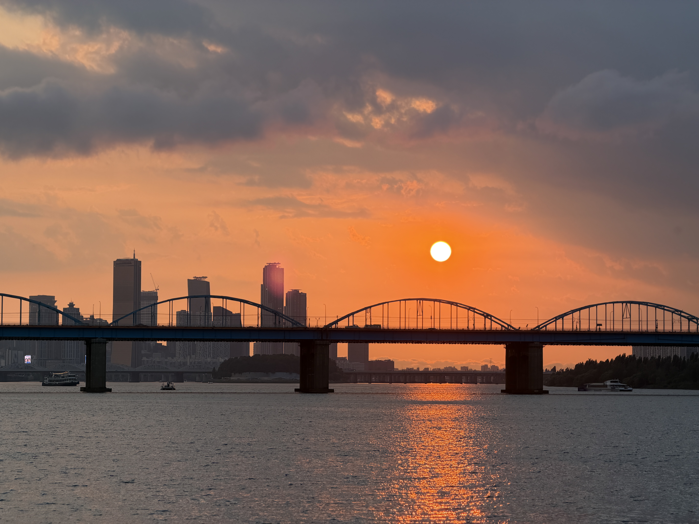
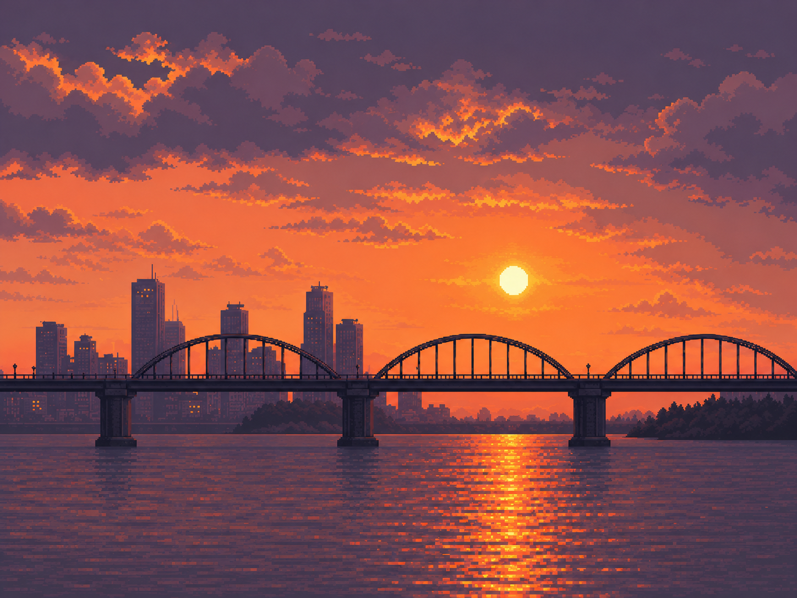
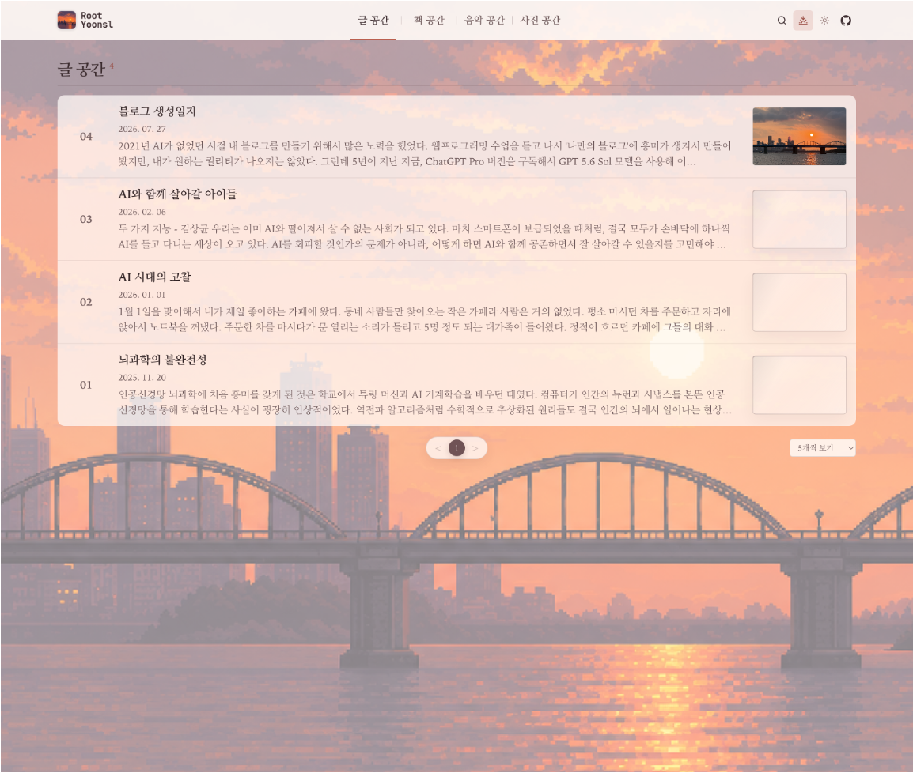
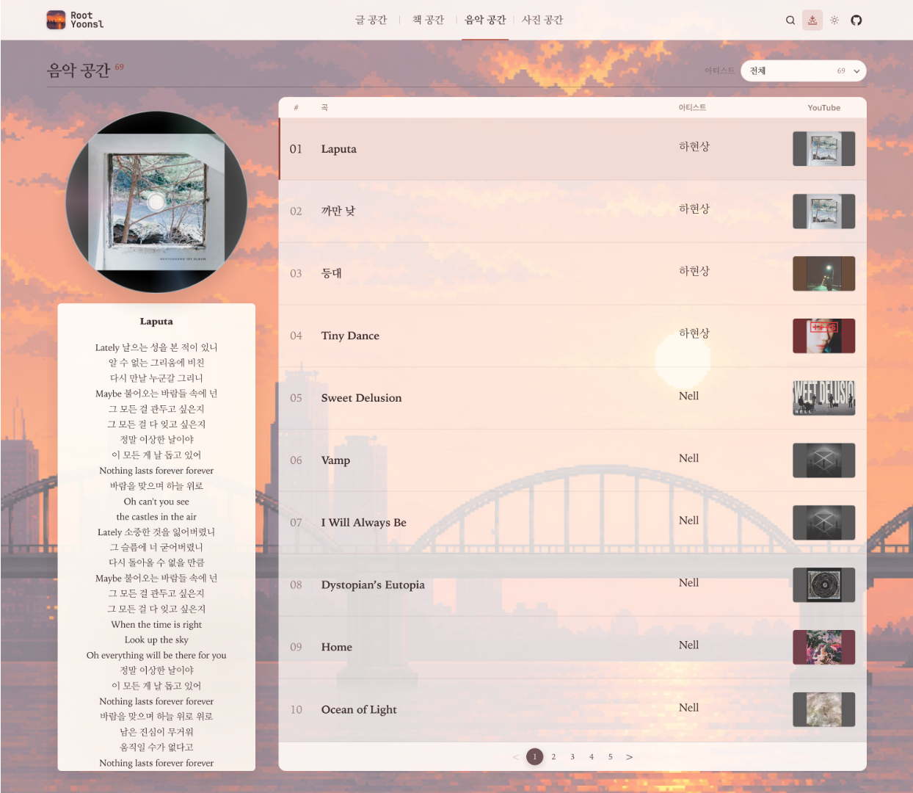

2021년 AI가 없었던 시절 내 블로그를 만들기 위해서 많은 노력을 했었다. 웹프로그래밍 수업을 듣고 나서 '나만의 블로그'에 흥미가 생겨서 만들어봤지만, 내가 원하는 퀄리티가 나오지는 않았다.

그런데 5년이 지난 지금, `ChatGPT Pro` 버전을 구독해서 `GPT 5.6 Sol` 모델을 사용해 이 블로그를 이틀만에 완성했다. 웹프로그래밍 지식은 다 까먹었지만 어떤 흐름으로 웹사이트를 만드는지는 기억하고 있어서 프롬프트를 구체적으로 입력했더니 이런 결과가 나왔다. 예전부터 내가 만들고 싶던 기능들을 정확하게 모두 구현했다.

### 배경사진

`ChatGPT`를 가지고 놀던 중에, 이미지 만들기 기능을 알게 되었다. 내가 직접 찍은 노을 사진을 바탕으로 픽셀 아트 형식의 그림을 만들어달라고 했는데, 생각보다 결과물이 너무 만족스러웠다.

이 그림을 어떻게 써먹을까 고민하다가 내가 예전에 블로그를 만들고 싶어했던 것을 떠올리고 이 그림이 테마인 블로그를 만들어봐야겠다는 생각이 들었다.

이 블로그는 라이트 모드, 다크 모드 외에도, 노을 배경 테마가 있다. 이 블로그의 테마 종류는 총 4가지가 있다: `라이트 노을모드`, `라이트 단색모드`, `다크 노을모드`, `다크 단색모드`. 블로그를 처음 켰을 때 나오는 화면은 `라이트 노을모드`이고, 우상단의 두 가지 테마 버튼을 통해서 화면의 색상을 변경할 수 있다.

### 공간

나는 나만의 `공간`을 좋아한다. 여기서의 `공간`은 실존하는 장소의 개념보다, 내 취향을 담은 추상적인 어떤 것들의 집합을 의미한다. 이 블로그는 나의 취향을 4가지 분야로 나누어서 각각을 공간으로 만들었다.

### 글 공간

이전에 쓰던 네이버 블로그나 티스토리 블로그에 올렸던 형태의 글을 올리려고 한다. 자주 쓰지는 못하더라도 내 기억을 온전히 보존하고 싶다는 생각이 들 때면 종종 남기러 올 것 같다.

### 책 공간

내가 읽었던 책들의 목록과 교보문고 페이지를 연결해두었다. 독서감상문을 잘 쓰는 편은 아니라서 별도의 기록은 없지만, 내가 어떤 책을 인상깊게 읽었고 독서 취향이 무엇인지 남겨두고자 만들어보았다.

### 음악 공간

내가 자주 들었던 음악들의 유튜브 주소와 가사를 한 페이지에서 볼 수 있게 만들었다. 중간중간 음악 스트리밍 앱이 바뀔 때마다 내 이전 음악 알고리즘이 사라지는 것이 귀찮았었는데, 이제 내 음악 도서관에 알고리즘을 보관할 생각이다.
CD 위에 커서를 올리면 CD가 회전하지만, 음악이 직접 재생되지는 않는다. 유튜브로 음악을 재생해두고 CD 위에 커서를 올리면 직접 노래를 듣는 기분을 느낄 수 있을 것이다.

### 사진 공간

2024년 이후로 찍었던 사진 중 마음에 드는 사진들만 골라서 전시해두었다. `아이폰 15 ProMax`, `아이폰 17 ProMax`, `FUJIFILM X100VI` 세 개의 기기로 찍은 사진들이 골고루 섞여있다.
