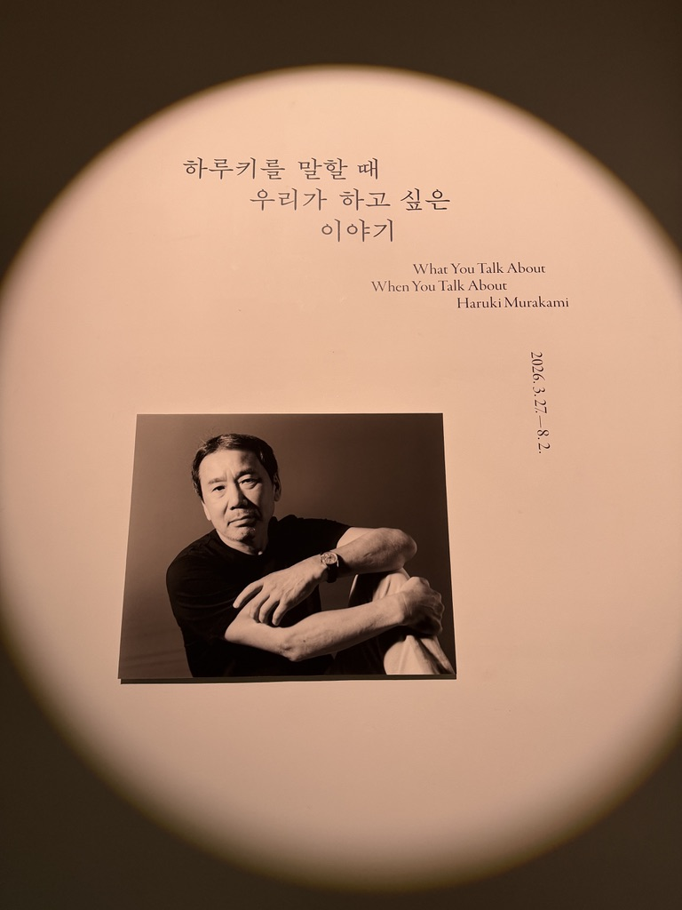
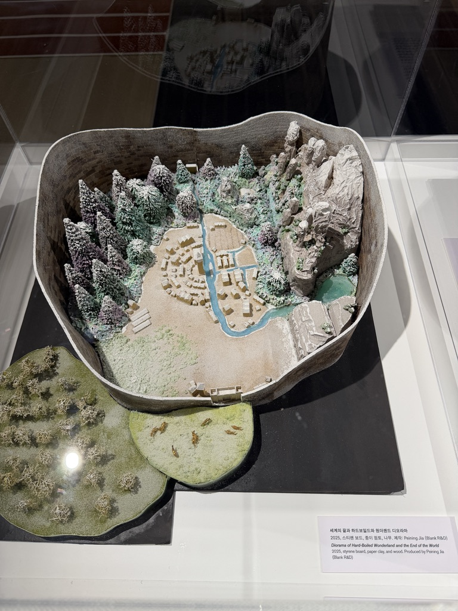
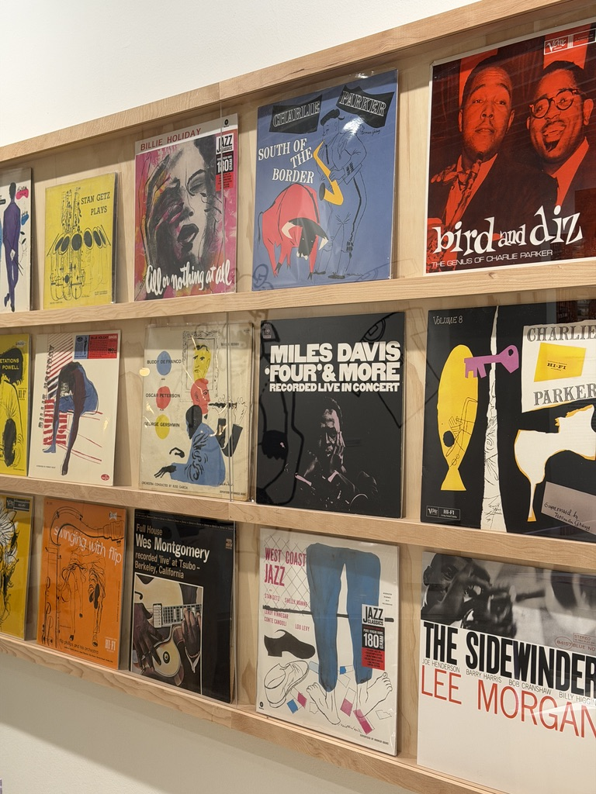
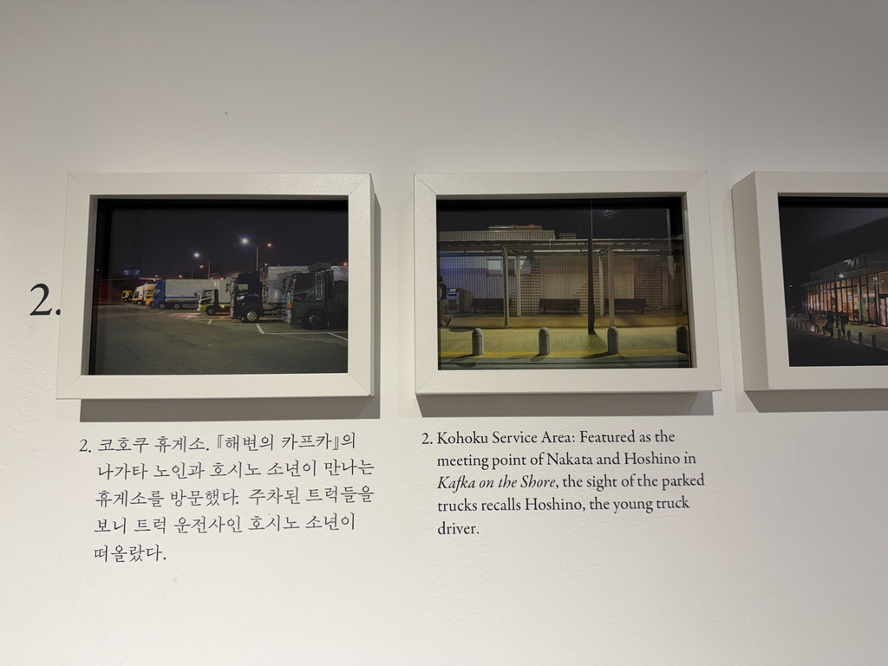
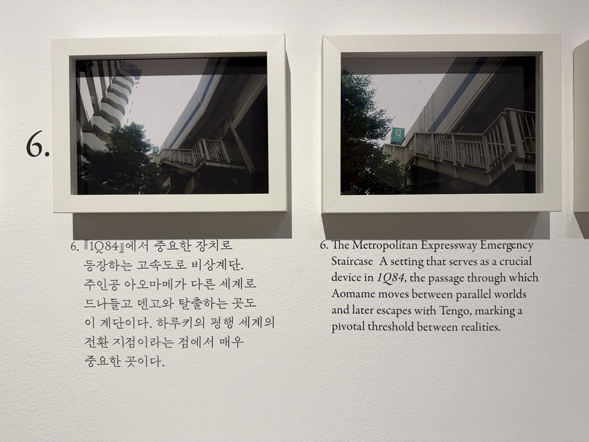
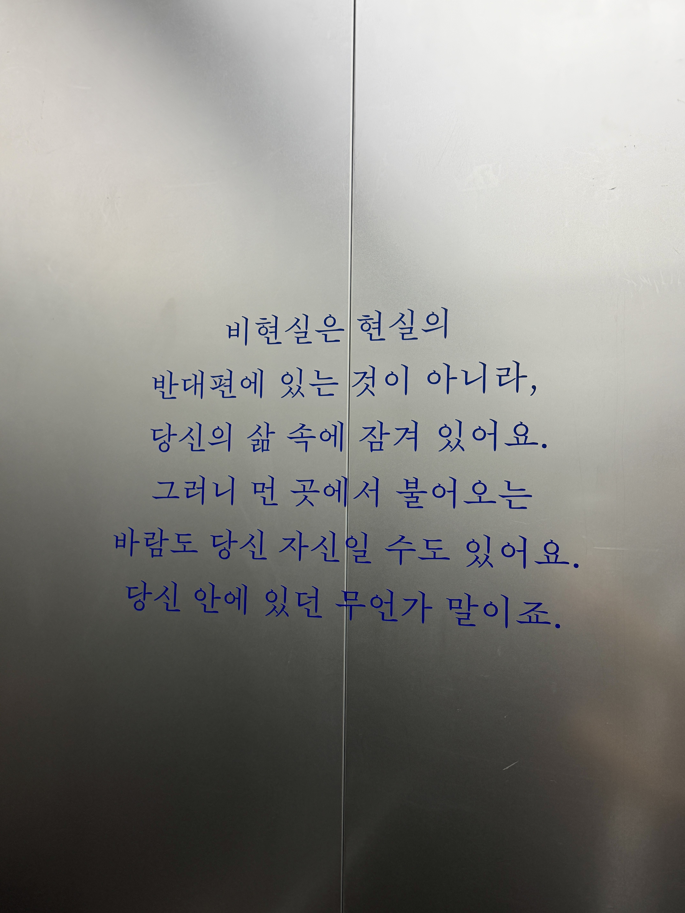
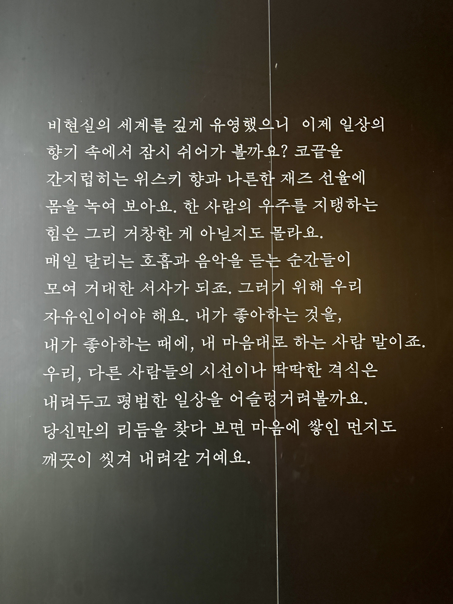
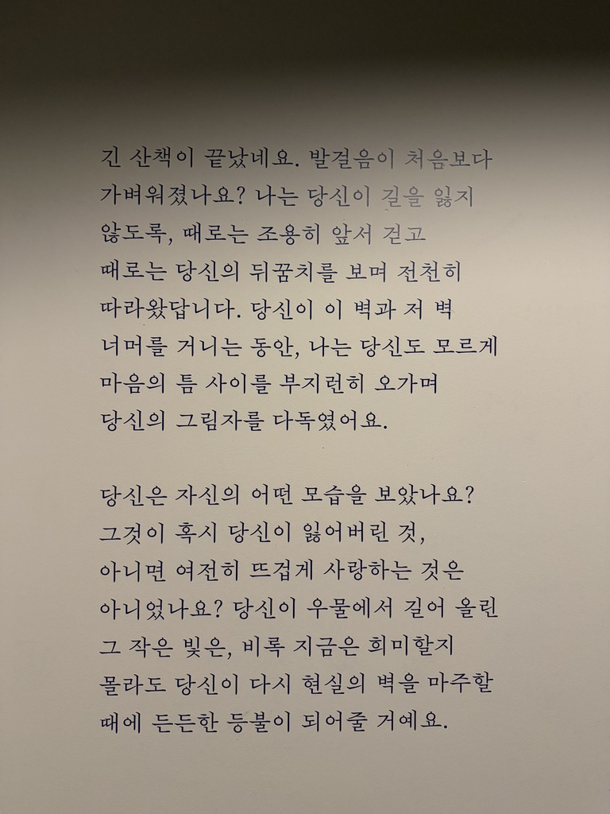

### 무라카미 하루키의 세계

무라카미 하루키의 세계는 깊고 몽환적이다. 현실과 비현실의 경계가 선명하게 나뉘지 않고, 구체적인 설명 대신 메타포가 불확실한 세계의 모습을 드러낸다. 세밀하게 묘사된 사물과 풍경은 내 상상력을 자극하여 현실에서 벗어난 듯한 감각을 남긴다.

나는 지금까지 하루키의 소설 여섯 작품을 읽었다.
『세계의 끝과 하드보일드 원더랜드』, 『노르웨이의 숲』, 『해변의 카프카』, 『1Q84』, 『기사단장 죽이기』, 『도시와 그 불확실한 벽』.

그중 『도시와 그 불확실한 벽』을 시작으로 나는 하루키의 세계에 빠져들었다. 어떤 작품이 가장 재미있었는지를 묻는다면 쉽게 답하기 어렵다. 작품마다 서로 다른 풍경과 분위기가 있고, 각각의 세계가 저마다의 방식으로 내 머릿속에 남아 있기 때문이다.

### 소설 속 풍경

내 머릿속에는 소설 속 풍경들이 그림처럼 남겨져있다. 언덕 위에 서 있는 멘시키 와타루의 집, 미끄럼틀 위에서 두 개의 달을 바라보는 덴고, 높은 벽으로 둘러싸인 세계의 끝, 고양이와 대화를 나누는 나가타상.

지금까지 많은 소설을 읽었지만, 하루키의 작품만큼 장면이 또렷하게 그려지는 소설은 드물었다. 나는 바로 그 점 때문에 그의 세계에 더욱 깊이 빠져들었다. 책을 덮고 오랜 시간이 지난 뒤에도 그 풍경들은 사라지지 않는다. 명상을 하거나 아무 생각 없이 멍하니 있을 때면, 소설 속 장면들이 문득 떠오르기도 한다.

### 잡히지 않지만 보이는 것

나는 몽환적인 것들을 사랑한다. 음악 공간에 전시해둔 음악들 중에도 몽환적인 분위기의 곡이 많다. 노을과 윤슬, 구름과 별빛 같은 풍경 역시 내게는 현실 속에 존재하면서도 어딘가 비현실적인 것으로 다가온다.

하루키의 세계 역시 비현실과 맞닿아 있다. 그것은 현실에 영향을 미치지만, 어디서부터 시작되고 어디에서 끝나는지는 알 수 없다. 마치 구름이 분명 눈앞에 보이지만, 손을 뻗어도 붙잡을 수 없는 것과 비슷하다. 나는 하루키의 소설을 읽으며 그 세계를 간접적으로 체험한다. 나는 그 풍경들을 머릿속에 차곡차곡 저장해두었다가, 때때로 다시 꺼내 바라본다. 현실에서 잠시 멀어지고 싶을 때마다 그 세계는 나만의 안식처가 되어준다.

### 하루키를 말할 때 우리가 하고 싶은 이야기

얼마 전에 『하루키를 말할 때 우리가 하고 싶은 이야기』 라는 전시가 열려서 보고 왔다. 마침 하루키에게 빠져 있을 때 이런 전시가 열려서 좋은 기회였다. 소설을 읽는 것과는 또 다른 방식으로 그의 세계를 탐험할 수 있었던 시간이었다.

위 작품은 『세계의 끝과 하드보일드 원더랜드』에 등장하는 ‘세계의 끝’ 마을을 3D로 형상화한 것이다.

이 마을은 『도시와 그 불확실한 벽』에도 등장한다. 처음 그 작품을 읽었을 때는 두 소설이 같은 세계관을 공유하고 있다는 사실을 알지 못했다. 전시를 다녀온 뒤 『세계의 끝과 하드보일드 원더랜드』를 읽게 되었는데, 전시에서 보았던 마을의 모습을 머릿속에 그리며 읽으니 풍경들이 더 생생하게 느껴졌다.

하루키의 소설을 읽은 뒤에는 재즈와 클래식에도 자연스럽게 관심이 생겼다. 유튜브에서 하루키가 좋아했던 음악을 모은 플레이리스트를 찾아 듣고, 소설 속 인물들이 즐겨 듣던 곡들도 내 플레이리스트에 하나씩 담기 시작했다. 대표적인 곡이 『1Q84』에서 중요한 역할을 하는 레오시 야나체크의 [신포니에타](https://youtu.be/9KdtupyQ2eI?si=HNq5e6-gLHBHIcRq)다. 아니나 다를까, 유튜브 댓글 대부분이 나처럼 소설을 읽고 찾아온 사람들이었다.

:::gallery layout="grid"

:::

이 사진들은 오랫동안 하루키의 작품을 읽어온 작가가 소설 속 장소들을 직접 찾아가 촬영한 것이라고 한다. 책을 읽으며 상상했던 장소와 실제 사진 속 풍경이 놀라울 만큼 닮아 있어 신기했다. 나도 기회가 된다면 하루키의 세계를 직접 탐험해보는 일본 여행을 떠나보고 싶다.

마지막으로 전시에서 인상 깊었던 글귀들을 가져와보았다. 잠시 하루키의 세상 속에 빠져들었다가 나온 것 같은 기분이 들어서 즐거웠다.

> 비현실은 현실의
> 반대편에 있는 것이 아니라,
> 당신의 삶 속에 잠겨 있어요.
> 그러니 먼 곳에서 불어오는
> 바람도 당신 자신일 수도 있어요.
> 당신 안에 있던 무언가 말이죠.

> 비현실의 세계를 깊게 유영했으니 이제 일상의
> 향기 속에서 잠시 쉬어가 볼까요? 코끝을
> 간지럽히는 위스키 향과 나른한 재즈 선율에
> 몸을 누여 보아요. 한 사람의 우주를 지탱하는
> 힘은 그리 거창한 게 아닐지도 몰라요.
> 매일 달리는 호흡과 음악을 듣는 순간들이
> 모여 거대한 서사가 되죠. 그러기 위해 우리
> 자유인이어야 해요. 내가 좋아하는 것을,
> 내가 좋아하는 때에, 내 마음대로 하는 사람 말이죠.
> 우리, 다른 사람들의 시선이나 딱딱한 격식은
> 내려두고 평범한 일상을 어슬렁거려볼까요.
> 당신만의 리듬을 찾다 보면 마음에 쌓인 먼지도
> 깨끗이 씻겨 내려갈 거예요.

> 긴 산책이 끝났네요. 발걸음이 처음보다
> 가벼워졌나요? 나는 당신이 길을 잃지
> 않도록, 때로는 조용히 앞서 걷고
> 때로는 당신의 뒤꿈치를 보며 천천히
> 따라왔답니다. 당신이 이 벽과 저 벽
> 너머를 거니는 동안, 나는 당신도 모르게
> 마음의 틈 사이를 부지런히 오가며
> 당신의 그림자를 다독였어요.
> 당신은 자신의 어떤 모습을 보았나요?
> 그것이 혹시 당신이 잃어버린 것,
> 아니면 여전히 뜨겁게 사랑하는 것은
> 아니었나요? 당신이 우물에서 길어 올린
> 그 작은 빛은, 비록 지금은 희미할지
> 몰라도 당신이 다시 현실의 벽을 마주할
> 때에 든든한 등불이 되어줄 거예요.
